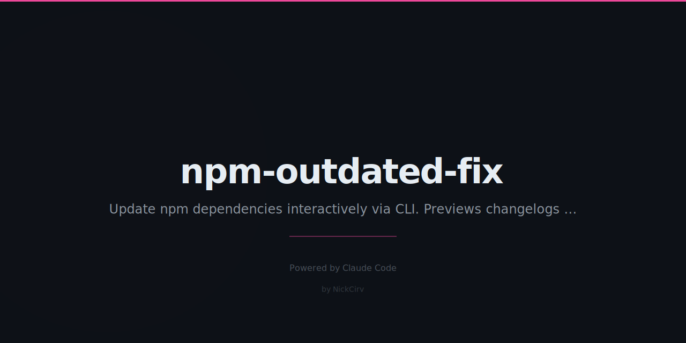

# npm-outdated-fix

> Interactive npm updater. Select packages, see changelogs, update safely. Zero deps.

[](https://www.npmjs.com/package/npm-outdated-fix)
[](https://nodejs.org)
[](https://github.com/NickCirv/npm-outdated-fix)
[](LICENSE)

---

## Install

Run without installing:

```bash
npx npm-outdated-fix
```

Or install globally:

```bash
npm install -g npm-outdated-fix
```

---

## Quick Start

```bash
# Interactive TUI — pick exactly what to update
nof

# Auto-update all patch versions
nof --patch

# Auto-update patch + minor
nof --minor

# Show major updates (explicit selection required)
nof --major

# Preview without making changes
nof --dry-run

# Production deps only
nof --production

# Machine-readable output
nof --format json
```

---

## TUI Demo

```
  Package                      Current    Wanted     Latest     Type    DL/wk
  ────────────────────────────────────────────────────────────────────────────
> [✓] express                  4.18.2     4.18.3     5.0.1      patch   52.4M
  [ ] typescript               5.3.0      5.3.3      5.4.0      minor   40.1M
  [ ] eslint                   8.50.0     8.57.0     9.0.0      major   30.2M

  [Space] toggle  [a] all  [Enter] update 1 selected  [q] quit
```

**Per-package info:**
- Package name
- Current version (red — outdated)
- Wanted version (green — semver-compatible)
- Latest version (yellow — may be a major bump)
- Update type: patch / minor / major
- Weekly downloads from npm registry

**When focused on a package**, the first 3 lines of its changelog or GitHub release notes appear beneath it.

---

## TUI Controls

| Key | Action |
|-----|--------|
| `Space` | Toggle selection |
| `a` | Select / deselect all |
| `Enter` | Update selected packages |
| `j` / `↓` | Move down |
| `k` / `↑` | Move up |
| `q` | Quit without updating |

---

## Options

| Flag | Description |
|------|-------------|
| `--patch` | Auto-update all packages to latest patch version |
| `--minor` | Auto-update all packages to latest minor version |
| `--major` | Show only major updates (interactive selection) |
| `--production` | Only non-devDependencies |
| `--dry-run` | Show what would be updated, no changes made |
| `--format json` | Machine-readable JSON list of updates |
| `--force` | Skip uncommitted git changes check |
| `--help` | Show help |

---

## JSON Output

```bash
nof --format json
```

```json
[
  {
    "name": "express",
    "current": "4.18.2",
    "wanted": "4.18.3",
    "latest": "5.0.1",
    "type": "dependencies",
    "updateType": "patch"
  }
]
```

---

## Safety

**Git dirty check** — If you have uncommitted changes, `nof` warns you and exits. This keeps your diff clean so you can see exactly what the update changed. Override with `--force`.

**Stash checkpoint** — Before any updates, `nof` creates a `git stash` with the label `npm-outdated-fix checkpoint`. If something goes wrong, restore with:

```bash
git stash pop
```

**One at a time** — Packages update sequentially, not in a bulk install. If one fails, the others are unaffected.

**No shell injection** — All commands use `spawnSync` with explicit argument arrays. Never `exec` or shell string interpolation.

---

## How It Works

1. Runs `npm outdated --json` to detect outdated packages
2. Fetches weekly download counts from the npm API
3. Fetches changelogs from GitHub releases or `CHANGELOG.md`
4. Presents an interactive TUI for selection
5. Updates with `npm install pkg@version` — one at a time

---

## Requirements

- Node.js 18+
- npm (comes with Node.js)

No npm dependencies. Uses only Node.js built-ins: `child_process`, `https`, `fs`, `path`, `readline`.

---

## Contributing

Issues and PRs welcome at [github.com/NickCirv/npm-outdated-fix](https://github.com/NickCirv/npm-outdated-fix).

---

Built with Node.js · Zero npm deps · MIT License
